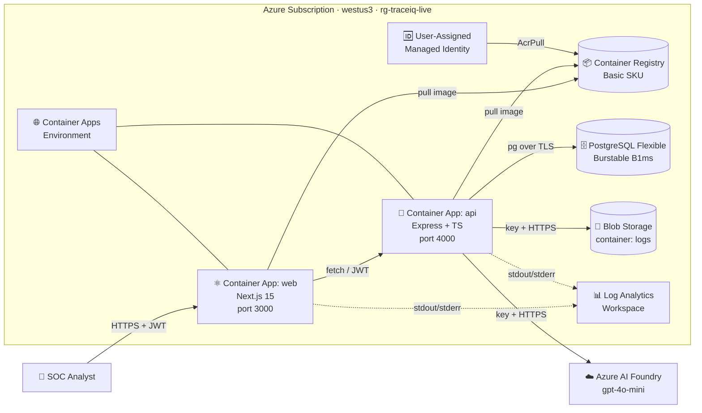
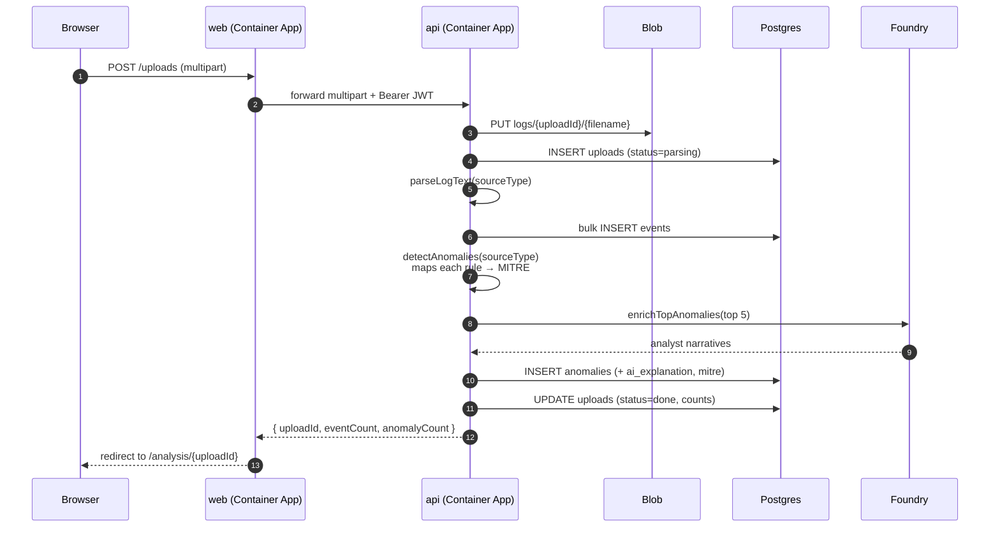
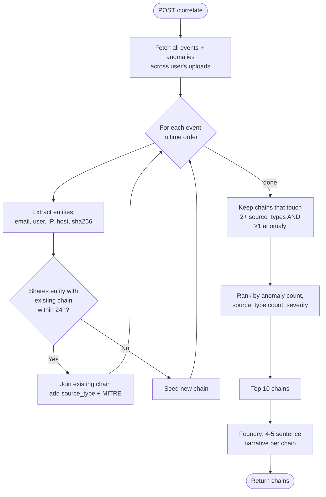
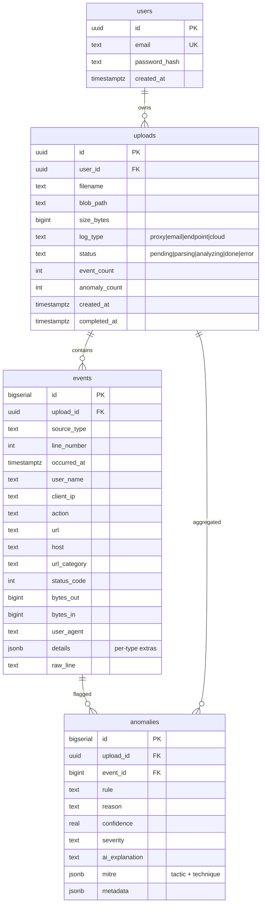

# TraceIQ — Architecture

Author: **Matthew Faber**

## At a glance

TraceIQ is a two-tier containerized app deployed on Azure Container Apps,
fronted by a Microsoft-managed TLS certificate at `traceiq.matthew-faber.com`.
PostgreSQL holds parsed logs and detector output, Azure Blob holds the
original upload, and Azure AI Foundry (`gpt-4o-mini`) writes the analyst
narratives layered on top of the deterministic detection.

## Components

| Component | Azure service | SKU / config | Purpose |
|---|---|---|---|
| **web** | Container Apps | min=0 max=2, 0.25 vCPU / 0.5 GiB | Next.js 15 (App Router) UI |
| **api** | Container Apps | min=0 max=2, 0.5 vCPU / 1 GiB | Express REST API + parsers + correlator |
| **postgres** | Database for PostgreSQL Flexible Server | Burstable B1ms, 32 GB | users / uploads / events / anomalies |
| **blob** | Storage Account | Standard_LRS, single container `logs` | raw uploaded log files |
| **registry** | Container Registry | Basic, admin disabled | private docker images |
| **identity** | User-assigned Managed Identity | — | AcrPull (and future KV/Blob access) |
| **environment** | Container Apps Managed Environment | Consumption | shared compute + ingress for both apps |
| **observability** | Log Analytics Workspace | PerGB2018, 30-day retention | container stdout / runtime metrics |
| **ai** | Azure AI Foundry project | `gpt-4o-mini` deployment | per-anomaly + per-chain narratives |
| **dns / cert** | Container Apps managed cert | Free | `traceiq.matthew-faber.com` |

## End-to-end request flow — single-log upload

## Cross-log correlation flow

The killer feature. Pulls events + anomalies from EVERY "done" upload the
user owns and walks them chronologically.

### Why these design choices?

- **Drop the event when no shared entity** — TraceIQ doesn't try to join
  unrelated incidents. A chain only grows when there's hard evidence
  (same user, same IP, same file hash) that two events are about the same
  thing.
- **24-hour window** — Mandiant's median dwell time for opportunistic
  attacks is under a day. Wider windows would join unrelated incidents
  from different weeks.
- **2+ source_types filter** — the per-upload screen already shows
  single-source findings. The correlator only surfaces what's new:
  multi-stage attacks that span systems.
- **LLM is last** — every chain is fully usable without Foundry. If the
  model is down or unconfigured, you get the deterministic chain with
  events, entities, and MITRE techniques. The narrative is sugar on top.

## Authentication & secrets

- **User auth:** username/password → JWT (12h, HS256). Token stored in
  `localStorage`; sent as `Authorization: Bearer …` on every API call.
- **DB:** username/password via `DATABASE_URL`, stored as Container App
  secret. Flexible Server firewall allows Azure services only.
- **Blob:** connection string secret. (See `SECURITY.md` — managed
  identity is the production-grade path.)
- **Foundry:** key stored as Container App secret `foundry-key`.
  Endpoint baked in as plain env var.
- **ACR pull:** user-assigned managed identity (`UAMI`) has `AcrPull` —
  no admin user, no password.

## Data model

## Where AI is used

Exactly two functions in [`apps/api/src/services/foundry.ts`](apps/api/src/services/foundry.ts):

1. **`explainAnomaly`** — per upload, the top 5 anomalies by confidence
   get a 2-3 sentence analyst note: what the activity looks like, what
   threat it could indicate, one concrete next step.
2. **`explainChain`** — per correlated attack chain, a 4-5 sentence
   incident narrative: the likely attack story, MITRE tactics involved,
   affected user/host, two concrete containment steps.

Both calls are **best-effort**. Failures degrade silently to deterministic
output. The app never blocks waiting for Foundry.

## CI/CD

- **Source:** https://github.com/MTFUCF/traceiq
- **Builds:** Docker multi-stage builds in `apps/api/Dockerfile` and
  `apps/web/Dockerfile`. Output pushed to ACR with `:latest` tag.
- **Deploy:** `az containerapp update --image …:latest` rolls a new
  revision; old revision drains and terminates.
- **Pipeline:** `.github/workflows/deploy.yml` runs the same flow on
  every push to `main` using OIDC federated credentials (no secrets in
  GitHub — short-lived tokens only).

## Cost (steady state, idle)

| Resource | Monthly (idle) |
|---|---|
| Container Apps (scale-to-zero × 2) | ~$0–10 |
| PostgreSQL Burstable B1ms | ~$15 |
| Storage (LRS, <1 GB) | <$1 |
| Container Registry Basic | ~$5 |
| Log Analytics (30-day, <1 GB) | <$3 |
| Foundry `gpt-4o-mini` | pay-per-token; ~$0–2/mo at demo volume |
| Managed cert + DNS | free |
| **Total** | **~$25–35/mo** |
