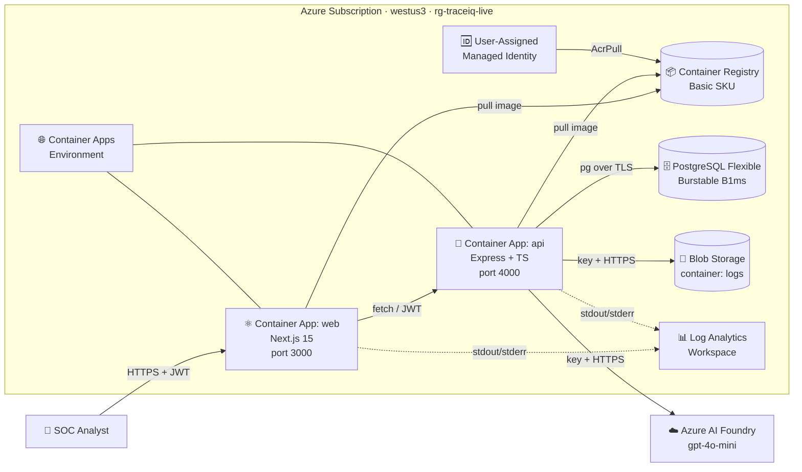

# TraceIQ

**Cross-log SOC analysis platform. Upload web proxy, email security, endpoint / EDR, and cloud sign-in logs. Get a triage-ready dashboard with statistical anomaly detection, MITRE ATT&CK mapping, and AI-powered attack-chain correlation.**

Author: **Matthew Faber**
Stack: Next.js 15 + Express + PostgreSQL + Azure Container Apps + Azure AI Foundry
Repo: https://github.com/MTFUCF/traceiq
Live demo: *(filled in after first deploy — `https://traceiq.matthew-faber.com`)*

---

## Table of contents

1. [What this is](#what-this-is)
2. [Architecture](#architecture)
3. [Repository layout](#repository-layout)
4. [Local setup](#local-setup)
5. [Sample data — the "alice gets phished" story](#sample-data--the-alice-gets-phished-story)
6. [How anomaly detection works](#how-anomaly-detection-works)
7. [How cross-log correlation works](#how-cross-log-correlation-works)
8. [MITRE ATT&CK mapping](#mitre-attck-mapping)
9. [Where AI is used (Azure AI Foundry)](#where-ai-is-used-azure-ai-foundry)
10. [API reference](#api-reference)
11. [Database schema](#database-schema)
12. [Deploying to Azure](#deploying-to-azure)
13. [Custom domain (matthew-faber.com)](#custom-domain-matthew-fabercom)
14. [CI/CD](#cicd)
15. [Trade-offs and things I'd change for production](#trade-offs-and-things-id-change-for-production)

---

## What this is

TraceIQ helps a SOC analyst answer two questions about a pile of log files
in **minutes instead of hours**:

1. **"What's interesting in this one file?"** Per-upload analysis: summary
   cards, per-minute timeline, top talkers, anomalies (each one MITRE
   ATT&CK-mapped), and the first 500 events with anomaly highlighting.
2. **"What's the bigger story across all my logs?"** Cross-log correlation
   walks all uploads, links events by shared entities (user, IP, file hash,
   host) within a 24h window, and surfaces the resulting **attack chains** —
   sequences that span multiple log types. Azure AI Foundry writes a 4-5
   sentence analyst narrative for each chain.

The four supported log types in v1:

| Type | Source | Pivot fields |
|---|---|---|
| 🌐 **proxy**    | ZScaler web proxy            | client IP, user, host, URL |
| 📧 **email**    | Defender/Mimecast/Proofpoint | recipient, sender domain, attachment SHA-256, URL in body |
| 🖥 **endpoint** | Defender for Endpoint / EDR  | endpoint hostname, logged-in user, process tree, file SHA-256 |
| ☁ **cloud**    | Azure AD sign-ins            | principal (UPN), IP, country, app, risk level |

Each log type is JSON-Lines — one JSON object per line. A standalone
generator (`samples/generate.js`) creates realistic examples.

## Architecture



The two services are independent Docker images deployed to the same Azure
Container Apps environment. They share an Azure Container Registry and a
user-assigned managed identity (used for `AcrPull` and Key Vault reads).

See [`ARCHITECTURE.md`](ARCHITECTURE.md) for the full sequence diagrams
(single-upload flow, correlation flow), data model ERD, and per-component
SKU + cost breakdown.

## Repository layout

```
traceiq/
├── apps/
│   ├── api/                       Express + TS REST API
│   │   └── src/
│   │       ├── config.ts                   validated env loader
│   │       ├── db/{client,migrate,schema.sql}
│   │       ├── middleware/auth.ts          JWT verify + sign
│   │       ├── routes/
│   │       │   ├── auth.ts                 POST /auth/login, GET /auth/me
│   │       │   ├── uploads.ts              upload + parse + analyze + queries
│   │       │   └── correlate.ts            POST /correlate
│   │       └── services/
│   │           ├── events.ts               shared ParsedEvent shape
│   │           ├── parser.ts               dispatcher + auto-detect
│   │           ├── parsers/{proxy,email,endpoint,cloud}.ts
│   │           ├── anomaly.ts              per-type detectors + dispatcher
│   │           ├── mitre.ts                ATT&CK rule→technique catalog
│   │           ├── storage.ts              Azure Blob wrapper
│   │           ├── correlation.ts          cross-upload chain builder
│   │           └── foundry.ts              Azure AI Foundry (anomaly + chain narrative)
│   └── web/                        Next.js 15 (App Router) frontend
│       └── src/
│           ├── app/
│           │   ├── layout.tsx
│           │   ├── login/page.tsx
│           │   ├── dashboard/page.tsx           upload form + log type picker
│           │   ├── analysis/[id]/page.tsx       per-upload dashboard
│           │   └── correlation/page.tsx         cross-upload attack chains
│           ├── components/{AuthGate,SignOutButton,MitreBadge}.tsx
│           └── lib/api.ts                       typed fetch wrapper
├── infra/                          Bicep IaC
├── samples/
│   ├── generate.js
│   ├── sample-benign.log                    300 normal proxy events
│   ├── sample-suspicious.log                400 proxy events with planted attacks
│   ├── sample-email-phishing.log            phishing email to alice
│   ├── sample-endpoint-edr.log              EDR detections on alice's laptop
│   └── sample-cloud-azuread.log             Azure AD sign-ins, incl. impossible travel
├── azure.yaml                      azd config
├── docker-compose.yml              local Postgres + Azurite
└── README.md
```

## Local setup

### Prerequisites
- **Node 22+** and **npm 10+**
- **Docker** (for local Postgres + Azurite)
- *(For Azure deploy)* **Azure CLI** + **Azure Developer CLI (azd)**

### Steps

```bash
npm install
npm run db:up                                  # Postgres + Azurite
cp .env.example .env
npm run -w @traceiq/api migrate                # creates schema + seeds admin
npm run dev                                    # api on :4000, web on :3000
```

Open **http://localhost:3000** and sign in with the credentials from `.env`
(`admin@traceiq.local` / `ChangeMe123!` by default).

### Stopping
```bash
npm run db:down
```

## Sample data — the "alice gets phished" story

The samples folder contains a deliberately co-timed multi-stage attack
spread across three log types. Upload all three (in any order) and click
**Correlate** to see TraceIQ stitch them into a single attack chain.

| File | Story |
|---|---|
| `sample-email-phishing.log`  | 10:14 — alice receives a phishing email from `ceo-quick-question@corp-io.support` with attachment `Invoice_2025-04.docm` (sha256 8f3a…). |
| `sample-endpoint-edr.log`    | 10:31 — alice's laptop opens the attachment. Outlook → Word → PowerShell → Emotet detected (sev 92/100). Defender blocks the dropper. |
| `sample-cloud-azuread.log`   | 11:30 — 12 failed sign-ins for alice from a Russian IP (TOR exit). 11:38 — finally succeeds. Impossible travel (Seattle → Moscow in 48 minutes). |

There are also two proxy logs:

- `sample-benign.log` — normal proxy traffic. 0–1 anomalies.
- `sample-suspicious.log` — 5 planted proxy attacks, one per detection rule
  (burst, high block ratio, malware category, rare scanner UA, large exfil).

Re-generate any of these with `node samples/generate.js`.

## How anomaly detection works

The detector lives in [`apps/api/src/services/anomaly.ts`](apps/api/src/services/anomaly.ts).
It dispatches by source type and applies deterministic rules. Each
`Anomaly` carries:

- `rule` — short id (e.g. `office_spawns_shell`)
- `reason` — human-readable one-liner
- `confidence ∈ [0,1]` — ranking signal (not a calibrated probability)
- `severity` — `low | medium | high`
- `mitre` — ATT&CK tactic + technique (see next section)
- `metadata` — rule-specific fields for the UI

### Rule catalog

| Source | Rule | What it flags | MITRE technique |
|---|---|---|---|
| 🌐 proxy | `burst_from_ip`     | One IP making > 50 req/min OR z-score > 3 within its own per-minute distribution | T1595.002 |
| 🌐 proxy | `high_block_ratio`  | An IP with ≥ 10 requests and ≥ 50% blocked | T1595 |
| 🌐 proxy | `malicious_category`| ZScaler category in {Malware, Phishing, Botnet, …} | T1071 |
| 🌐 proxy | `rare_user_agent`   | UA seen exactly once + 4xx/5xx (catches `sqlmap`, custom implants) | T1036 |
| 🌐 proxy | `large_exfil`       | Single request bytes_out ≥ 10 MB | T1041 |
| 📧 email | `phishing_email`    | Verdict = Phishing                                 | T1566.002 |
| 📧 email | `malware_attachment`| Verdict = Malware AND attachment present           | T1566.001 |
| 🖥 endpoint | `malware_detected`     | Verdict = Malware                              | T1204.002 |
| 🖥 endpoint | `office_spawns_shell`  | Office app parent + shell child (winword.exe → powershell.exe) | T1059.001 |
| 🖥 endpoint | `suspicious_process`   | severity_score ≥ 70                            | T1059 |
| ☁ cloud | `failed_login_burst` | ≥ 8 failed sign-ins for one user in 10 minutes | T1110 |
| ☁ cloud | `impossible_travel`  | Successful sign-ins from countries > 800 km apart in < 2h | T1078.004 |
| ☁ cloud | `high_risk_signin`   | Azure AD risk level = medium/high              | T1078 |

### Why rules first, AI second?
- **Explainability** — analysts need *why* an alert fired, not "the model thinks it's bad".
- **Determinism** — same file in, same anomalies out. Auditable, testable.
- **Cost & latency** — rules run over a file in milliseconds.
- **Bounded blast radius** — if Foundry is down, the app still works fully.

## How cross-log correlation works

The correlator lives in [`apps/api/src/services/correlation.ts`](apps/api/src/services/correlation.ts).
Algorithm:

1. **Pool** anomalies + entity-bearing events from all "done" uploads
   belonging to the user.
2. **Extract entities** from each event — emails (lowercased), users
   (lowercased; email local-parts pivot too so `alice@corp.io` joins with
   EDR's `alice`), client IPs, hostnames, file SHA-256s.
3. **Walk chronologically.** For each event, find the most recent chain
   that shares an entity within **24h**. If one exists, join it. Otherwise
   seed a new chain.
4. **Filter** to chains that touch **2+ source_types** AND contain at least
   one anomaly. Single-source chains aren't really "correlations" — the
   per-upload screen already shows them.
5. **Rank** by (anomaly count desc, distinct source types desc, sum of
   anomaly severity desc) and return the top 10.
6. **Enrich** each chain with an Azure AI Foundry-written 4-5 sentence
   analyst narrative (best-effort; chain still returned if Foundry isn't
   configured).

Why these choices?
- **24h window** — Mandiant's median dwell time for opportunistic attacks
  is under a day. Catches multi-stage attacks without joining unrelated
  incidents from different weeks.
- **2+ source types** — that's what makes it a CROSS-LOG finding, the
  value-add over per-file analysis.
- **Email local-part as user pivot** — bridges the universal "alice on
  email" ↔ "alice logged into endpoint" ↔ "alice@corp.io in AAD" identity.

## MITRE ATT&CK mapping

Every anomaly is mapped to an ATT&CK tactic + technique via the catalog in
[`apps/api/src/services/mitre.ts`](apps/api/src/services/mitre.ts). The UI
shows a clickable indigo pill that deep-links to attack.mitre.org.
Cross-log chains aggregate the unique techniques from their events — so a
chain badge row reads at a glance like a mini ATT&CK matrix for the
incident.

## Where AI is used (Azure AI Foundry)

There are exactly **two** AI touchpoints in TraceIQ —
[`apps/api/src/services/foundry.ts`](apps/api/src/services/foundry.ts):

1. **`explainAnomaly`** — top-5 anomalies per upload (by confidence) get a
   2-3 sentence analyst note: what the activity looks like, what threat it
   could indicate, one concrete next step.
2. **`explainChain`** — every correlated attack chain gets a 4-5 sentence
   incident narrative: the likely attack story, MITRE tactics involved,
   affected user/host, and two concrete next steps. This is the output the
   on-call analyst pastes into the ticket.

### Why Azure AI Foundry (vs direct Azure OpenAI)?

Azure AI Foundry is Microsoft's unified model platform. A Foundry **project**
gives you:

- **One endpoint, many models.** The `@azure-rest/ai-inference` SDK speaks
  to OpenAI, Phi, Llama, Mistral, etc. — switching models is a config
  change (`AZURE_AI_FOUNDRY_DEPLOYMENT`), not a code change.
- **Project-level governance.** Quota, content safety, evaluation, and
  observability are scoped to the project.
- **Future-proof.** New model families plug in with zero refactor.

I deploy **`gpt-4o-mini`** inside the Foundry project — fast, cheap, and
the outputs (short structured narratives) play to its strengths.

### Setting up Foundry

1. Portal → **Azure AI Foundry** → create a project (region `eastus2`).
2. Project → **Deployments → + Deploy model → gpt-4o-mini**.
3. Project → **Keys and endpoint** → copy endpoint
   (`https://<project>.services.ai.azure.com/models`) + key.
4. Put them in `.env` (local) or azd env (Azure):
   ```
   AZURE_AI_FOUNDRY_ENDPOINT=https://<project>.services.ai.azure.com/models
   AZURE_AI_FOUNDRY_API_KEY=<key>
   AZURE_AI_FOUNDRY_DEPLOYMENT=gpt-4o-mini
   ```

If you skip this step, TraceIQ still works — every anomaly still gets a
rule-based reason and confidence; only the AI narrative fields are empty.

## API reference

All endpoints except `POST /auth/login` require `Authorization: Bearer <token>`.

| Method | Path                          | Description                                  |
|--------|-------------------------------|----------------------------------------------|
| POST   | `/auth/login`                 | `{ email, password }` → `{ token, user }`   |
| GET    | `/auth/me`                    | Current user                                 |
| POST   | `/uploads`                    | `multipart` `file` + form `log_type` (`proxy`/`email`/`endpoint`/`cloud`/`auto`) |
| GET    | `/uploads`                    | List the user's uploads                      |
| GET    | `/uploads/:id`                | Metadata + summary stats + top IPs / hosts   |
| GET    | `/uploads/:id/events`         | Paginated events (`?limit&offset`)           |
| GET    | `/uploads/:id/anomalies`      | All anomalies + MITRE mapping                |
| GET    | `/uploads/:id/timeline`       | Per-minute buckets for the chart             |
| DELETE | `/uploads/:id`                | Delete upload + cascade rows                 |
| POST   | `/correlate`                  | `{ uploadIds?: [] }` → `{ chains: [...] }`  |
| GET    | `/health`                     | Liveness probe                               |

## Database schema

Four tables (see [`apps/api/src/db/schema.sql`](apps/api/src/db/schema.sql)):

- **`users`** — id, email (unique), password_hash (bcrypt), created_at.
- **`uploads`** — id, user_id, filename, blob_path, size_bytes, **log_type**
  (`proxy|email|endpoint|cloud`), status, error, event_count, anomaly_count,
  timestamps.
- **`events`** — id (bigserial), upload_id, **source_type**, line_number,
  occurred_at, user_name, client_ip, action, url, host, url_category,
  status_code, bytes_out, bytes_in, user_agent, **details JSONB**, raw_line.
  Generic columns shared across all source types; `details` carries the
  type-specific extras (email subject, malware family, sign-in country, …).
- **`anomalies`** — id, upload_id, event_id, rule, reason, confidence,
  severity, ai_explanation, **mitre JSONB**, metadata.

## Deploying to Azure

You'll need: an Azure subscription, **Azure CLI**, **Azure Developer CLI
(azd)**, and **Docker**.

```bash
az login --tenant 549e0345-48a7-474e-9f8b-48610087dcac
az account set --subscription c152612b-c239-4f41-9ca4-7ffc733084da
azd auth login

azd env new traceiq-dev
azd env set AZURE_LOCATION eastus2
azd env set AZURE_AI_FOUNDRY_ENDPOINT "https://<project>.services.ai.azure.com/models"
azd env set AZURE_AI_FOUNDRY_API_KEY "<key>"
azd env set AZURE_AI_FOUNDRY_DEPLOYMENT "gpt-4o-mini"

azd env set DB_ADMIN_PASSWORD     "$(openssl rand -base64 24)"
azd env set JWT_SECRET            "$(openssl rand -base64 32)"
azd env set SEED_ADMIN_PASSWORD   "$(openssl rand -base64 16)"

azd up
```

> `NEXT_PUBLIC_API_URL` is baked into the web image at build time. After the
> first `azd up`, set it to the API Container App's FQDN and run
> `azd deploy web` once more so the web image is rebuilt against the right
> origin. (For production you'd put both apps behind one domain + reverse
> proxy and skip this step.)

## Custom domain (matthew-faber.com)

After `azd up`:

```bash
WEB_FQDN=$(az containerapp show -n ca-traceiq-web-<suffix> -g rg-traceiq-dev \
  --query "properties.configuration.ingress.fqdn" -o tsv)

# At your DNS host for matthew-faber.com, add:
#   CNAME  traceiq           -> $WEB_FQDN
#   TXT    asuid.traceiq     -> <id from the next command>
az containerapp hostname add \
  --name ca-traceiq-web-<suffix> --resource-group rg-traceiq-dev \
  --hostname traceiq.matthew-faber.com

az containerapp hostname bind \
  --name ca-traceiq-web-<suffix> --resource-group rg-traceiq-dev \
  --hostname traceiq.matthew-faber.com \
  --environment cae-traceiq-<suffix> \
  --validation-method CNAME
```

After ~5 minutes, `https://traceiq.matthew-faber.com` will resolve with a
Microsoft-managed TLS cert.

## CI/CD

`.github/workflows/deploy.yml` runs `azd up` on every push to `main` via
OIDC federated credentials. To enable:

1. `az ad sp create-for-rbac --name traceiq-ci --role contributor --scopes /subscriptions/c152612b-c239-4f41-9ca4-7ffc733084da`
2. Add `AZURE_CLIENT_ID`, `AZURE_TENANT_ID`, `AZURE_SUBSCRIPTION_ID` as repo secrets.

## Trade-offs and things I'd change for production

This is a deliberately small functional prototype. In priority order:

1. **Async processing.** Upload returns immediately; a worker (Functions /
   ACA Jobs) does parse + analyze. UI polls for status.
2. **Streaming parser.** Today we load the whole file into memory. Replace
   with `readline` + per-line insert for multi-GB uploads.
3. **Managed-Identity auth** for Postgres, Blob, and Foundry (currently
   key/conn-string). UAMI is already attached to the Container Apps.
4. **httpOnly cookies + CSRF tokens** instead of localStorage JWT
   (mitigates XSS).
5. **Private endpoints + VNet integration** for Postgres and Blob.
6. **Richer correlator** — periodic beaconing, DGA domains, JA3/JA4
   fingerprint clustering, user behavior baselines.
7. **Persisted chains** — today correlation is computed on demand. Cache
   recent chains and incrementally update as new uploads land.
8. **App Insights** on both Container Apps for Foundry token/latency
   telemetry.
9. **Tests.** Vitest for parsers + detectors + correlator (pure functions);
   Playwright for the dashboard and correlation flow.

---

**Author:** Matthew Faber
**Submission contact:** `venkata@tenex.ai`
